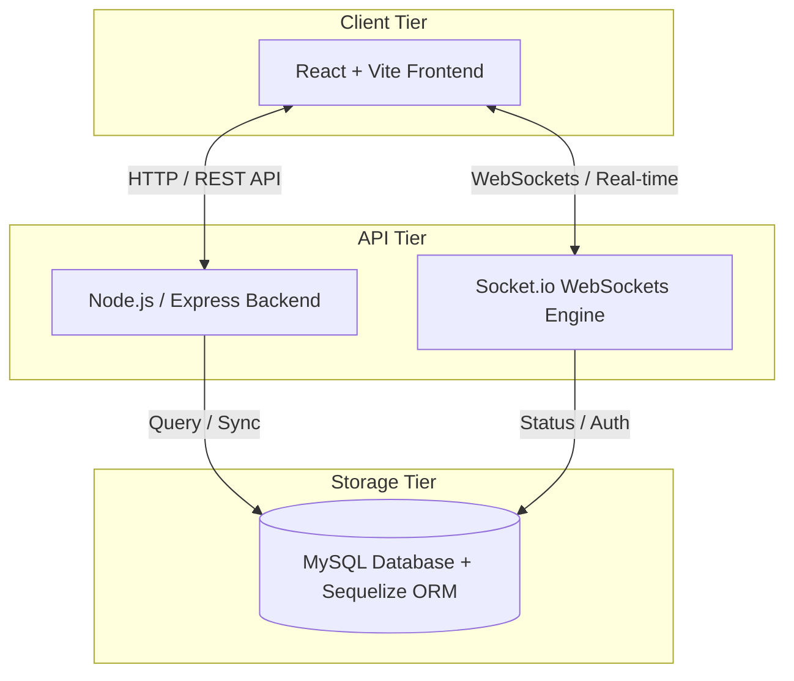

# 🎱 All 8 Pool

**All 8 Pool** is a modern, full-stack, enterprise-grade pool hall management platform and real-time player community portal. Built with **React (TypeScript + Vite)**, **Node.js (Express)**, **MySQL (Sequelize)**, and **Socket.io**, it bridges the gap between pool hall owners and billiard enthusiasts.

The application is divided into two distinct portals:
1. **Client / Player Portal**: A responsive web application where players discover local pool halls, reserve tables, participate in live matches, issue challenges, view rankings, and redeem loyalty rewards.
2. **Backoffice Portal**: A comprehensive management dashboard for pool hall owners and platform administrators to manage bookings, track revenue, coordinate live matches and tournaments, configure table rates, and handle billing with an integrated Point-of-Sale (POS) style interface.

---

## 🏗️ Architecture Overview



---

## ✨ Features

### 1. Client / Player Portal
*   🗺️ **Pool Hall Discovery**: Explore local pool halls with detailed information including business hours, table types, and pricing.
*   📅 **Table Booking**: Interactive booking wizard allowing players to reserve specific tables for slots in advance.
*   ⚔️ **Real-time Matchmaking & Challenges**: Find and challenge nearby players, log match scores, and track match history.
*   📊 **Player Rankings**: Unified leaderboard displaying player rankings, win ratios, and match stats.
*   💬 **Global Challenges Widget**: Floating real-time communication widget offering instant messaging and match requests.
*   🏆 **Tournaments**: Browse upcoming community tournaments and view dynamic tournament brackets.
*   🎁 **Reward Shop**: Earn loyalty points for bookings and matches, and redeem them for digital rewards or pool hall store vouchers.
*   🌐 **Multi-language Support**: Fully translated into English (en), French (fr), and Arabic (ar), with automatic text-direction (LTR/RTL) switching for Arabic.

### 2. Backoffice / Management Portal
*   📈 **Dashboard Analytics**: Real-time charts detailing revenue statistics, active occupancy rate, and popular table types.
*   📅 **Interactive Reservation Calendar**: Drag-and-drop booking scheduler and reservation grid for manager check-ins.
*   💳 **POS & Billing system**: Track table times dynamically, append additional charges (beverages, snacks), calculate totals, check out users, and generate receipts.
*   🎱 **Table Configuration**: Add and edit tables, set specific rates per hour, and define table sizes (e.g., 8-foot, 9-foot, Snooker).
*   🏆 **Tournament Bracket Manager**: Create tournaments, generate player seedings, and track live scores.
*   📊 **Financial Reporting**: Detailed breakdown of cash flow, table income, and snack bar sales with filterable timelines.
*   👥 **Customer Directory**: Central customer profiles listing contact information, booking history, and membership levels.
*   🛡️ **System Administration**: Multi-tenant approval mechanism to review incoming pool hall owner applications and configure global platform settings.

---

## 🛠️ Technology Stack

| Component | Technology | Description |
| :--- | :--- | :--- |
| **Frontend** | React 18, TypeScript, Vite | Fast, type-safe interactive components and single-page routing |
| **Styling** | Tailwind CSS | Utility-first clean dark-mode UI with smooth micro-animations |
| **State & Router** | Context API, React Router DOM | Seamless page transitions and secure state propagation |
| **Localization** | i18next | High-performance multi-language translation and RTL support |
| **Backend** | Node.js, Express | Scalable HTTP REST endpoints and middleware architecture |
| **Database** | MySQL | Robust relational storage with indexing for high read-write speeds |
| **ORM** | Sequelize | Object-Relational Mapper for automated schema syncing and queries |
| **Real-time** | Socket.io | WebSockets for instantaneous global chat and direct challenge requests |
| **Containerization** | Docker, Nginx | Multi-stage Dockerized environments with reverse-proxy static serving |

---

## 📂 Project Structure

```text
all8pool/
├── backend/
│   ├── src/
│   │   ├── api/                  # Routing, middlewares, and API controllers
│   │   │   ├── controllers/      # Route handler logics (auth, bookings, matches)
│   │   │   ├── middlewares/      # JWT validation and role authorization gates
│   │   │   └── routes/           # REST endpoint definitions
│   │   ├── infrastructure/       # Database connections and ORM models
│   │   │   └── database/
│   │   │       ├── database.js   # Sequelize connection configuration
│   │   │       └── models/       # Sequelize model declarations
│   │   └── server.js             # Entry point (Express server & Socket.io setup)
│   ├── Dockerfile                # Production multi-stage node builder
│   ├── package.json              # Backend script commands & dependencies
│   └── .env.example              # Sample environment variables file
├── frontend/
│   ├── src/
│   │   ├── api/                  # Axios configurations and request wrappers
│   │   ├── assets/               # Media and branding logo vectors
│   │   ├── client/               # Pages and widgets for the Player application
│   │   ├── backoffice/           # Pages and graphs for the Owner Dashboard
│   │   ├── locales/              # Translation translation tables (EN, FR, AR)
│   │   ├── shared/               # Reusable UI controls (Buttons, Selects, Modals)
│   │   ├── store/                # Authentication Context providers and hooks
│   │   ├── App.tsx               # Main Router and authentication guard routes
│   │   └── main.tsx              # React mounting root and styles loading
│   ├── Dockerfile                # Nginx multi-stage static asset server
│   ├── nginx.conf                # Custom Nginx configuration for single-page routing
│   ├── package.json              # Frontend script commands & dev dependencies
│   └── .env.example              # Local connection endpoint example
├── docker-compose.yml            # Local development orchestration setup
└── docker-compose.prod.yml       # Production environment deployment setup
```

---

## 🛢️ Database Schema & Models

The database comprises 8 core models mapped with Sequelize:
*   **`User`**: Account details (email, password, name, phone, role: `player` / `owner` / `admin`, ranking points, loyalty balance).
*   **`PoolHall`**: Pool hall business profiles (name, address, telephone, hours, owner identification).
*   **`Table`**: Individual tables mapped to a `PoolHall` (table number, type: `8-ball` / `9-ball` / `snooker`, hourly rate, status).
*   **`Booking`**: Reservations (user ID, table ID, start time, end time, total price, status: `pending` / `active` / `completed` / `cancelled`, optional extra charges).
*   **`Match`**: Matches between players (player 1, player 2, winner, scores, status: `pending` / `accepted` / `completed`, table ID).
*   **`Tournament`**: Tournament parameters (name, dates, registration parameters, total prizes, status).
*   **`Reward`**: Catalog rewards for points redemption (title, description, cost points, image).
*   **`OwnerRequest`**: Owner applications submitted by players wishing to register a new pool hall (user ID, credentials, approval status).

---

## ⚙️ Environment Variables

Copy the `.env.example` configurations in both respective folders and rename to `.env`.

### Backend Configuration (`backend/.env`)
```env
PORT=8080
DB_NAME=all8pool
DB_USER=root
DB_PASS=root
DB_HOST=db                 # Use "localhost" if running outside of Docker
JWT_SECRET=all8pool@@@     # Secret key for signing authorization tokens
```

### Frontend Configuration (`frontend/.env`)
```env
VITE_API_URL=http://localhost:8080/api  # Server REST API endpoint
```

---

## 🚀 Running the Project

### Method A: Running with Docker Compose (Recommended)
This starts all services (MySQL, Express backend API, and Vite + React frontend served via Nginx) inside isolated containers.

1.  **Clone the repository** and navigate to the project directory:
    ```bash
    git clone <repository-url>
    cd all8pool
    ```
2.  **Spin up the containers**:
    ```bash
    docker-compose up --build
    ```
3.  **Access the applications**:
    *   **Frontend Client / Backoffice**: [http://localhost:3000](http://localhost:3000)
    *   **Backend Server health check**: [http://localhost:8080/health](http://localhost:8080/health)
    *   **MySQL Database Port**: `3306`

---

### Method B: Manual Local Setup
For local development where you want hot-reloading on both frontend and backend without Docker.

#### Prerequisites
*   Node.js (v18 or higher)
*   MySQL Server (v8.0+) running locally on port 3306

#### Step 1: Initialize Database
Create a MySQL database named `all8pool`:
```sql
CREATE DATABASE all8pool;
```

#### Step 2: Setup and Start Backend
1.  Navigate into the backend directory:
    ```bash
    cd backend
    ```
2.  Create `.env` file from `.env.example`:
    ```bash
    cp .env.example .env
    ```
    *Make sure to update `DB_USER` and `DB_PASS` to match your local MySQL configuration, and set `DB_HOST=localhost`.*
3.  Install dependencies and start development server:
    ```bash
    npm install
    npm run dev
    ```
    *The API will start running on [http://localhost:5000](http://localhost:5000) or port defined in your `.env`.*

#### Step 3: Setup and Start Frontend
1.  Open a new terminal and navigate to the frontend directory:
    ```bash
    cd frontend
    ```
2.  Create `.env` file from `.env.example`:
    ```bash
    cp .env.example .env
    ```
    *Ensure `VITE_API_URL` matches the backend address (e.g., `http://localhost:5000/api`).*
3.  Install dependencies and run:
    ```bash
    npm install
    npm run dev
    ```
4.  Open the URL output in your terminal (typically [http://localhost:5173](http://localhost:5173)).
